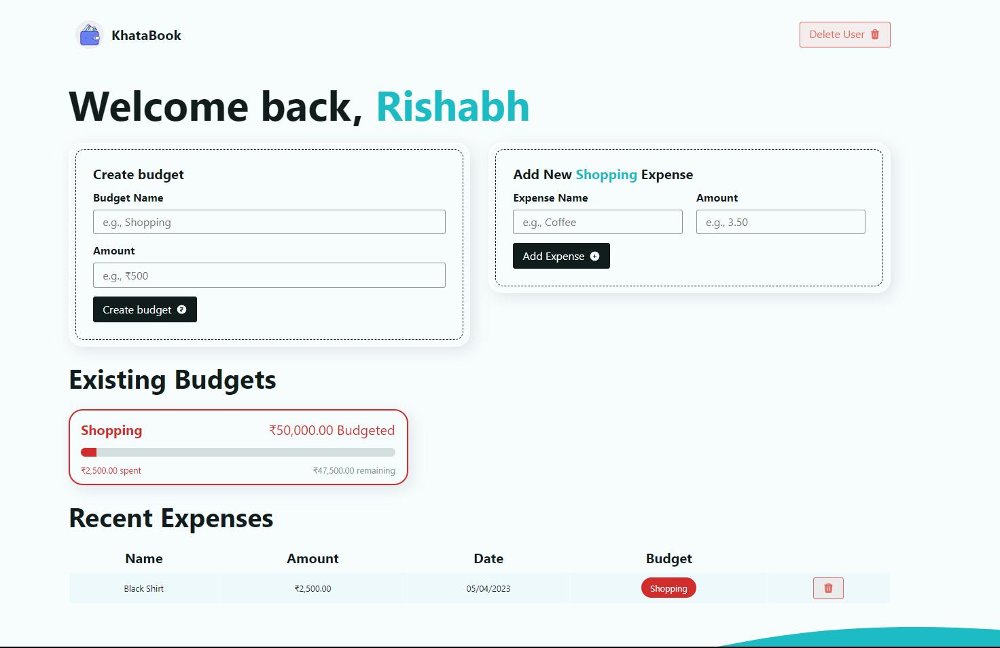

# React Router Budget App

This is an interactive budget app using React Router 6.8 and local storage.

[Demo App](https://khata-book-by-rishabhsaklani.netlify.app/)

The app is built using the React JavaScript library, which provides a powerful framework for building responsive and dynamic user interfaces.

The app is designed to be easy to use and navigate, with a clean and intuitive interface. Users can create multiple budgets, each with its own set of categories and spending limits. They can add expenses and income to each budget, with the app automatically tracking their spending and providing insights into their financial health related to the project.

The app includes a range of features to help users manage their budgets and track their spending related to their GitHub repository. These include:

Customizable categories: Users can create their own categories for expenses and income related to their project, making it easy to track spending across different areas of their project.

Budget tracking: The app provides real-time tracking of spending against budget limits, so users can see how much they have left to spend in each category related to their project.

## Skills 
HTML, CSS3, JavaScript, React, and React Router. 

## Helpful Links:
- [Demo project](https://khata-book-by-rishabhsaklani.netlify.app/)

## Connect With Me
- Mail: rishabhsaklani7@gmail.com
